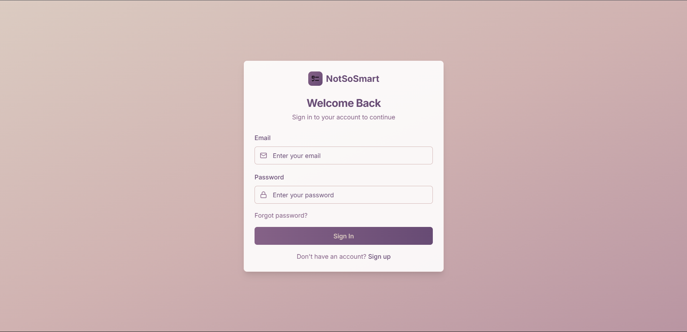
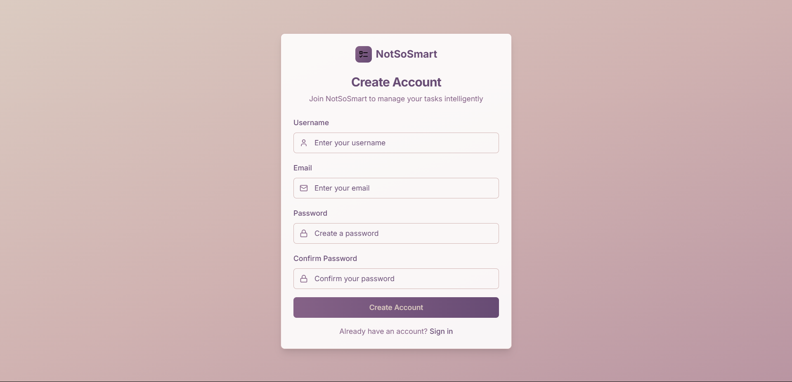
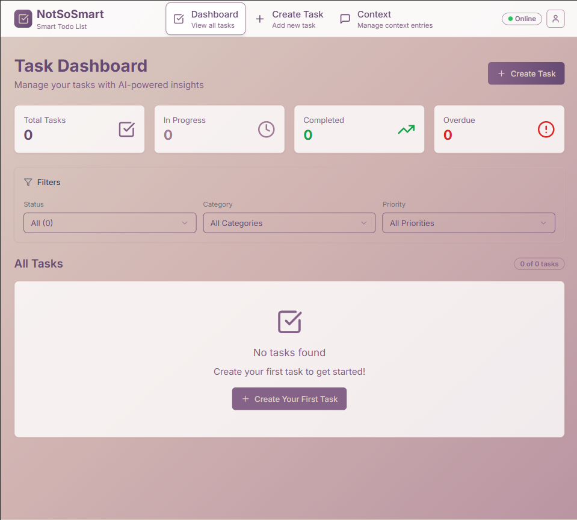
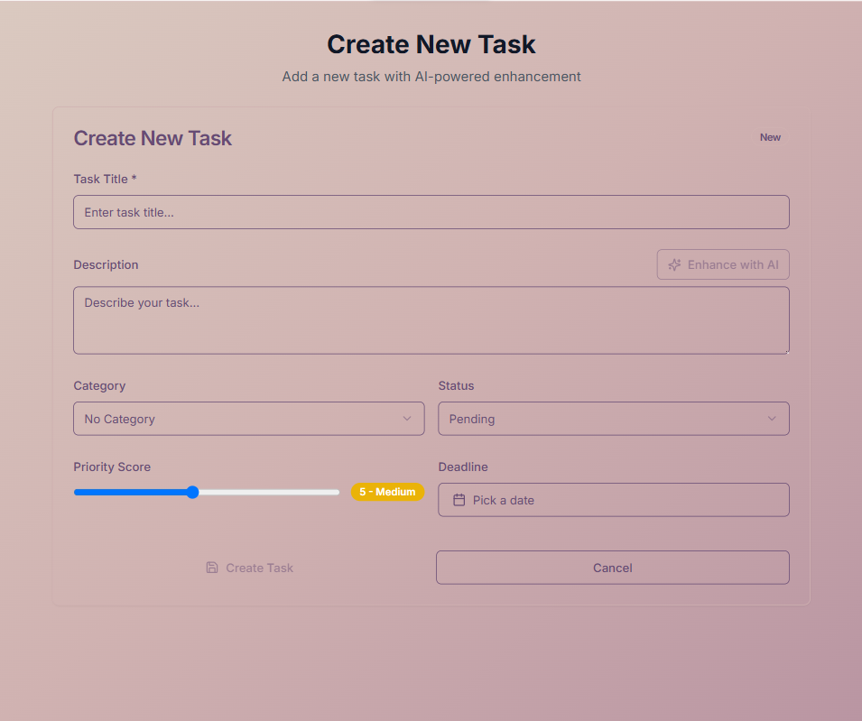
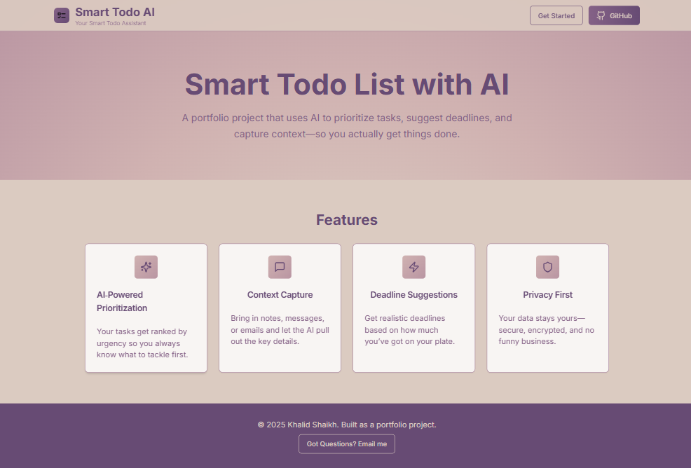

# 🧠 NotSoSmart — AI-Powered Todo App

[](https://notsosmart.onrender.com)
[](#tech-stack)
[](LICENSE)

**NotSoSmart** is a smart productivity web app that uses AI to help you manage and prioritize your tasks effectively.  
It features user authentication, task management, AI-driven suggestions, and auto-categorization — all in one clean UI.

---

## 🚀 Live Demo

- 🔗 Frontend: [https://not-so-smart.vercel.app](https://not-so-smart.vercel.app)
- 🧠 Backend: [https://notsosmart.onrender.com](https://notsosmart.onrender.com)

---

## ✨ Features

- 🔐 **Authentication** (Register, Login, Password Reset) using Supabase
- 📋 **Task CRUD**: Create, edit, delete, and manage your todos
- 🧠 **AI Suggestions**: Smart task enhancements using Hugging Face models
- 🧩 **Category Prediction**: Tasks auto-tagged based on title & description
- 📚 **Contextual Memory**: Add context notes to help the AI guide you
- 🔒 **JWT-Protected APIs**: Supabase-authenticated endpoints

---

## 🧱 Tech Stack

### Frontend — `/client`

- Next.js 15 + React 18
- TailwindCSS for styling
- Redux Toolkit for state management
- React Hook Form + Zod for form handling and validation
- Radix UI for accessible UI components
- Axios for API communication

### Backend — `/server`

- Django 5 + Django REST Framework
- PostgreSQL (via Supabase)
- Supabase Auth (JWT)
- Hugging Face Inference API (for suggestions)
- CORS, dotenv, gunicorn (production server)

---

## 🗂️ Folder Structure

### `/client` Frontend

```

client/
├── app/
│   ├── auth/            # login, register, reset-password pages
│   ├── dashboard/       # main dashboard UI
│   ├── tasks/           # task creation & editing
│   ├── layout.tsx       # global layout
│   └── page.tsx         # main landing
├── components/          # shared UI components
├── contexts/            # React providers
├── hooks/               # custom React hooks
├── lib/                 # util libs
├── services/            # API interaction (authService, taskService, etc.)
├── store/               # Redux store setup
├── types/               # global TypeScript types
├── public/              # static assets like favicon, screenshots
└── utils/               # reusable logic

````


---

## 🖼️ Screenshots

| 📥 Login Page                     | 🆕 Register Page                        |
| --------------------------------- | --------------------------------------- |
|  |  |

| 📊 Dashboard Page                         | ➕ New Task Form                          |
| ----------------------------------------- | ---------------------------------------- |
|  |  |

| 🏠 Landing Page                       |
| ------------------------------------- |
|  |

--- 
## 📡 API Reference

📄 Full API docs available in [`api.md`](./api.md)

---

## 🔐 Authentication API

All tokens returned by `/login/` must be used in protected routes:

```http
Authorization: Bearer <access_token>
````

| Endpoint                       | Method | Auth | Description                    |
| ------------------------------ | ------ | ---- | ------------------------------ |
| `/api/auth/register/`          | POST   | ❌    | Register new user              |
| `/api/auth/login/`             | POST   | ❌    | Login with email & password    |
| `/api/auth/reset-password/`    | POST   | ❌    | Send reset link via email      |
| `/api/tasks/`                  | CRUD   | ✅    | Create/read/update/delete task |
| `/api/contexts/`               | CRUD   | ✅    | Add/view context entries       |
| `/api/categories/`             | CRUD   | ✅    | Task categories                |
| `/api/tasks/suggest-category/` | POST   | ✅    | Predict category using AI      |
| `/api/ai/suggestions/`         | POST   | ✅    | AI-generated task tips         |

---

## ⚙️ Running Locally

### 🔧 Backend Setup

```bash
cd server
python -m venv env
source env/bin/activate  # or env\Scripts\activate
pip install -r requirements.txt
python manage.py migrate
python manage.py runserver
```

Add your `.env` in `/server/`:

```env
# Django Settings
DEBUG=True
SECRET_KEY=your-secret-key
ALLOWED_HOSTS=localhost,127.0.0.1

# Supabase
SUPABASE_URL=https://your-supabase-url.supabase.co
SUPABASE_ANON_KEY=your-anon-key
SUPABASE_SERVICE_KEY=your-service-key

# PostgreSQL
DB_NAME=your-db-name
DB_USER=your-db-user
DB_PASSWORD=your-db-password
DB_HOST=your-db-host
DB_PORT=5432

# Hugging Face
HF_API_KEY=your-hf-key

# CORS
CORS_ALLOWED_ORIGINS=http://localhost:3000

```

---

### 💻 Frontend Setup

```bash
cd client
npm install
npm run dev
```

`.env` for frontend:

```env
NEXT_PUBLIC_API_URL=http://localhost:8000
```

---

## 📄 License

This project is licensed under the MIT License — use it, remix it, ship it.

---

## 🧑‍💻 Author

Built by [Shaikh Khalid](https://github.com/shk-khalid)

---